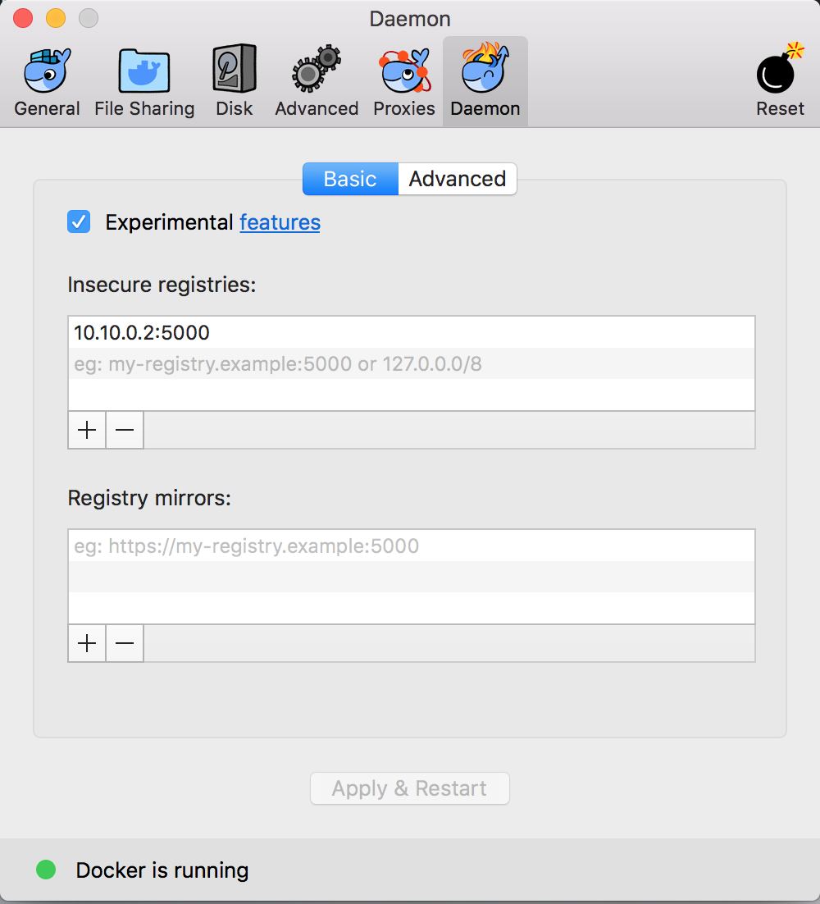

The following instruction details the steps required to run E2E tests with a Vagrant VM on your local machine, so you can test and debug locally.

# Benefits:
1. Set up a local vagrant VM Environment once and run "make e2e_all" to run E2E tests from your development environment.
1. No need to worry about kubernetes cluster setup. The scripts take care of that.
1. TODO: Debug tests right from your development environment.

# Prereqs:
1. Set up Istio Dev envrionment using https://github.com/istio/istio/wiki/Dev-Guide.

1. Install
  * [virtual box](https://www.virtualbox.org/wiki/Downloads) - Verify `virtualbox` command opens up a virtual box window
  * [docker](https://docs.docker.com/) - Verify `docker version` returns version >= 18.03.0-ce
  * [vagrant](https://www.vagrantup.com/downloads.html) - Verify `vagrant -v` returns version >= Vagrant 2.0.3
  * [kubectl](https://kubernetes.io/docs/tasks/tools/install-kubectl) - Verify `kubectl version` returns both server and client versions
  * [curl](https://curl.haxx.se/)

You can run the following OS specific scripts to install all pre-requisites, or use them as a reference to install them manually. .

```bash
// assumes [homebrew](https://brew.sh) exists for Mac
sh prereqs.sh
```

# Steps
## 1. Set up Vagrant Environment
```bash
sh startup.sh
```

## 2. Set up Docker daemon on Host
### macOS
Click on the docker icon and go into Preferences..., click into the Daemon tag.
Add `10.10.0.2:5000` to Insecure registries.
Finally click the `Apply and Start` button in the bottom to restart Docker with new setting.
The final setup should be like this:


### Linux
No, need to do anything, startup script above takes care of it.

## 3. Build istio images
Push images from your local dev environment to local registry on vagrant vm:
```bash
sh test_setup.sh
```
You should push new images whenever you modify istio source code.

## 4. Run tests!
E.g.
```bash
cd $ISTIO/istio
make e2e_simple E2E_ARGS="--use_local_cluster"
```
You can keep repeating this step if you made any local changes and want to run e2e tests again.
Add E2E_ARGS="--use_local_cluster" to all your e2e tests as tests are we are running a local cluster.


# Cleanup
1. Cleanup test environment
```bash
vagrant halt
```

2. Cleanup vagrant environment
This is necessary if you want to remove vagrant VM setup from your host and want to bring it back to original state
```bash
sh cleanup_linux_host.sh
```
